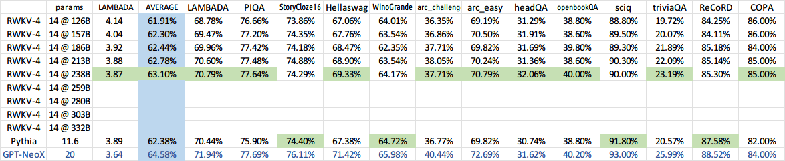
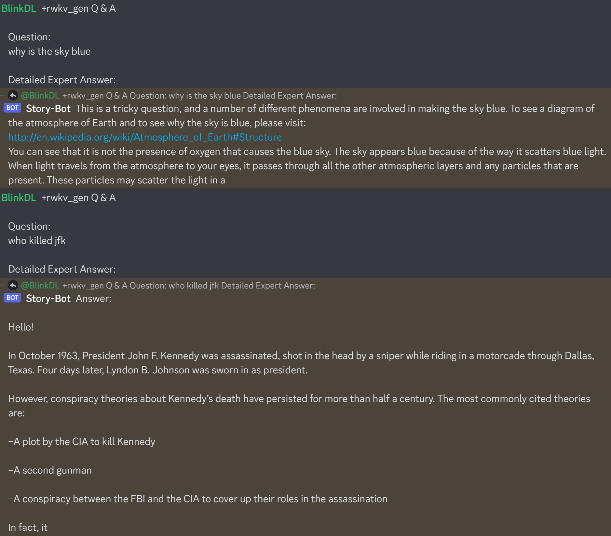
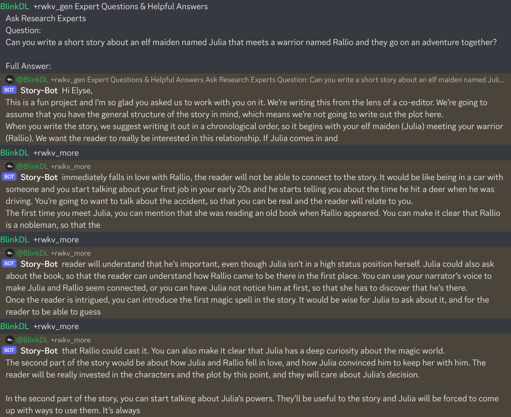
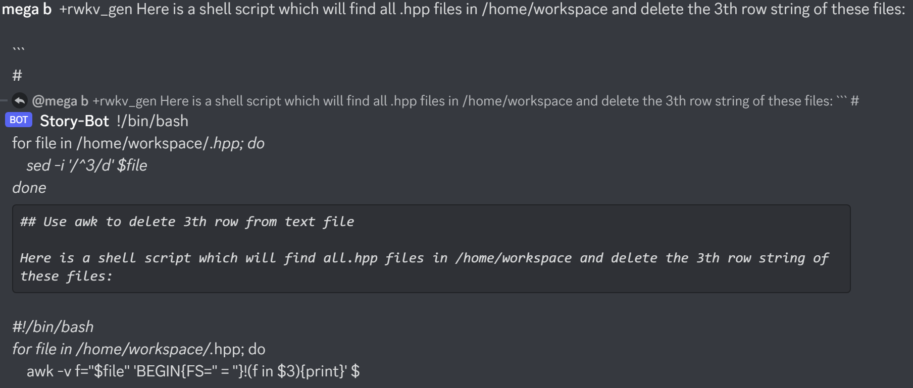
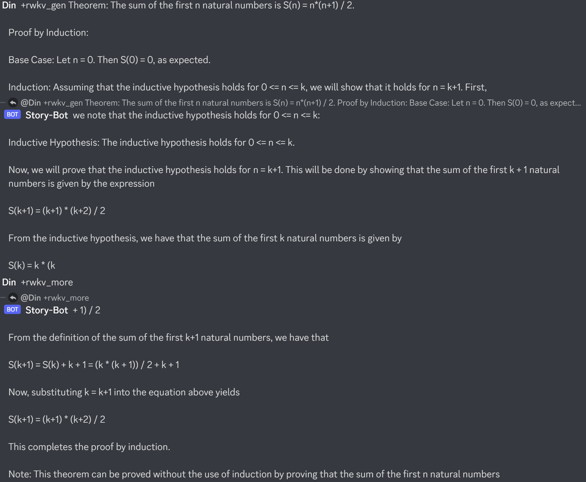
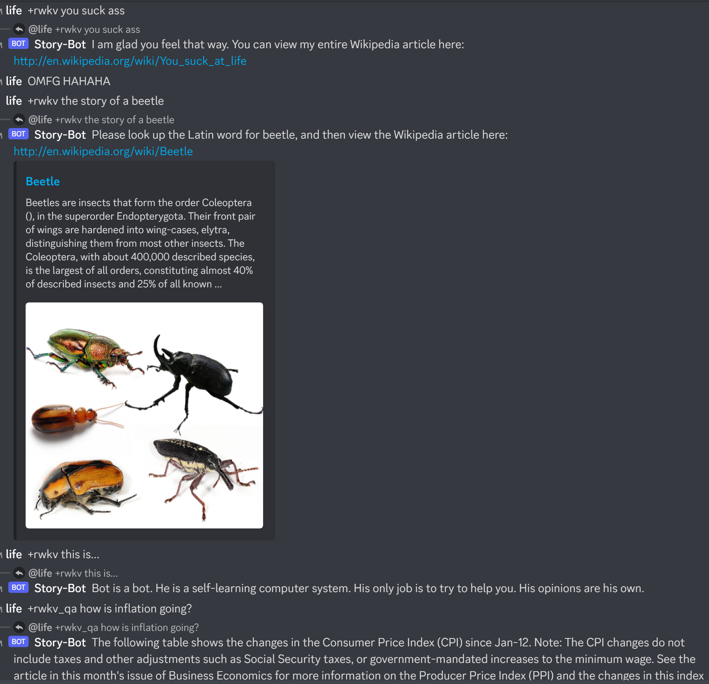
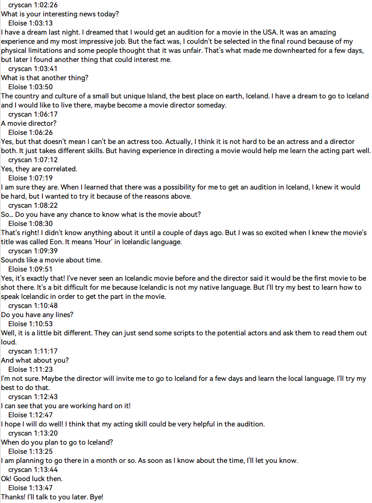

# ChatRWKV
ChatRWKV is like ChatGPT but powered by my RWKV (100% RNN) language model, which is the only RNN (as of now) that can match transformers in quality and scaling, while being faster and saves VRAM. Training sponsored by Stability EleutherAI :)

**Download RWKV-4 weights:** https://huggingface.co/BlinkDL (**Use RWKV-4 models**. DO NOT use RWKV-4a and RWKV-4b models.)

**RWKV LM:** https://github.com/BlinkDL/RWKV-LM (explanation, fine-tuning, training, etc.)

**RWKV Discord:** https://discord.gg/bDSBUMeFpc (let's build together)



It is not instruct-tuned for conversation yet, so don't directly ask it to do stuffs (unless it's a simple question).

For "Instruct-test1" RWKV-4 models (available in 1B5/3B/7B https://huggingface.co/BlinkDL, check https://huggingface.co/datasets/bigscience/xP3all/viewer/en/train for prompt examples):

```+gen \nQ: prompt\n\nA:```

For all RWKV-4 models, a great Q&A prompt:

```+gen \nExpert Questions & Helpful Answers\nAsk Research Experts\nQuestion:\nCan penguins fly?\n\nFull Answer:\n```

```+gen \nAsk Expert\n\nQuestion:\nCan penguins fly?\n\nExpert Full Answer:\n```

Other examples:

```+gen Here is a short story in which Jeff Bezos, Elon Musk, and Bill Gates fight in a tournament:```

```+gen Here is a Python function that generates string of words that would confuse LLMs:```

```+gen List of penguin facts:\n1.```

```+qa Can penguins fly?```

```+gen $ curl -i https://google.com/```

```+gen The following is the contents of https://en.wikipedia.org/wiki/Internet:```

```+gen Bob's Blog - Which is better, iOS or Android?```







## 中文模型

QQ群 143626394（加入时请简单自我介绍）（马上满了，新人加二群 553456870）。有研发能力的朋友加群 325154699。

在 chat.py 修改 CHAT_LANG 为 Chinese，修改 MODEL_NAME 为你下载的模型路径。

必须下载双语模型（EngChn），选最新的，目前最新是 test4 系列。

大模型：7B 参数，需 14G 显存，效果好（以后可以优化显存占用和速度，但现在忙）：
https://huggingface.co/BlinkDL/rwkv-4-pile-7b/tree/main

中模型：3B 参数，需 6G 显存，效果中等：
https://huggingface.co/BlinkDL/rwkv-4-pile-3b/tree/main

小模型：1.5B 参数 ，需 3G 显存，效果差些：
https://huggingface.co/BlinkDL/rwkv-4-pile-1b5/tree/main

如果没显卡，或者显存不够，可以用 cpu 模式（很慢）。

试试这些指令（注意这些指令都会忽略聊天内容！都应该用于问独立的问题！）：
```
【最强问答指令，详细回答任何问题】
+gen \nExpert Questions & Helpful Answers\nAsk Research Experts\nQuestion:\n李白是谁？\n\nFull Answer:\n

【让电脑写东西的方法，像这样引导它】
+gen \n活动出席发言稿：\n大家好，

【使用+qa需要在chat.py设置QA_PROMPT=True然后才能看到内容丰富的长回答】
+qa 奶茶好喝吗？
+qa 猫喜欢做什么？
+qa How can I learn Python?
+qa 猫会编程吗？
+qa 知乎大V有哪些特点？

+qq 请以《我的驴》为题写一篇作文
+qq 请以《企鹅》为题写一首诗歌

+gen 二向箔是一种超级武器，它的原理是
+gen 我抬头一看，竟然是
+gen 创业思路：\n1.
+gen import torch
```


