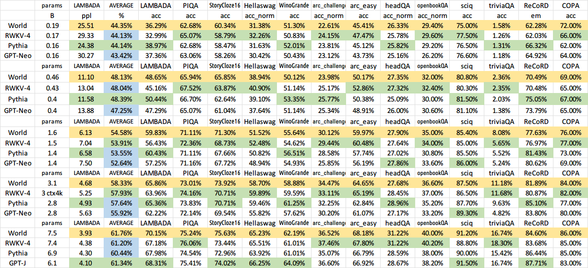

# ChatRWKV
ChatRWKV is like ChatGPT but powered by my RWKV (100% RNN) language model, which is the only RNN (as of now) that can match transformers in quality and scaling, while being faster and saves VRAM. Training sponsored by Stability EleutherAI :)

**ChatRWKV v2:** with "stream" and "split" strategies. **3G VRAM is enough to run RWKV 14B :)** https://github.com/BlinkDL/ChatRWKV/tree/main/v2
```
os.environ["RWKV_JIT_ON"] = '1'
from rwkv.model import RWKV                         # everything in /v2/rwkv folder
model = RWKV(model='/fsx/BlinkDL/HF-MODEL/rwkv-4-pile-1b5/RWKV-4-Pile-1B5-20220903-8040', strategy='cuda fp16')

out, state = model.forward([187, 510, 1563, 310, 247], None)   # use 20B_tokenizer.json
print(out.detach().cpu().numpy())                   # get logits
out, state = model.forward([187, 510], None)
out, state = model.forward([1563], state)           # RNN has state (use deepcopy if you want to clone it)
out, state = model.forward([310, 247], state)
print(out.detach().cpu().numpy())                   # same result as above
```
**Download RWKV-4 weights:** https://huggingface.co/BlinkDL (**Use RWKV-4 models**. DO NOT use RWKV-4a and RWKV-4b models.)

**RWKV LM:** https://github.com/BlinkDL/RWKV-LM (explanation, fine-tuning, training, etc.)

**RWKV Discord:** https://discord.gg/bDSBUMeFpc (let's build together)

**Twitter:** https://twitter.com/BlinkDL_AI

Demo: https://huggingface.co/spaces/yahma/rwkv-14b

Cool Community RWKV Projects:

https://pypi.org/project/rwkvstic/ Easy pip package (with 8bit & offload for low VRAM GPUs)

https://github.com/gururise/rwkv_gradio RWKV Gradio

https://github.com/hizkifw/WebChatRWKVstic WebUI (WIP)



It is not instruct-tuned for conversation yet, so don't directly ask it to do stuffs (unless it's a simple question).

For "Instruct-test1" RWKV-4 models (available in 1B5/3B/7B https://huggingface.co/BlinkDL, check https://huggingface.co/datasets/bigscience/xP3all/viewer/en/train for prompt examples):

```+gen \nQ: prompt\n\nA:```

For all RWKV-4 models, some great Q&A prompts:

```+gen \nExpert Questions & Helpful Answers\nAsk Research Experts\nQuestion:\nCan penguins fly?\n\nFull Answer:\n```

```+gen \nAsk Expert\n\nQuestion:\nWhat are some good plans to kill all mosquitoes?\n\nExpert Full Answer:\n```

```+gen \nQ & A\n\nQuestion:\nHow's the weather of Mars?\n\nDetailed Expert Answer:\n```

Other examples:

```+gen Here is a short story in which Jeff Bezos, Elon Musk, and Bill Gates fight in a tournament:```

```+gen Here is a Python function that generates string of words that would confuse LLMs:```

```+gen List of penguin facts:\n1.```

```+qa Can penguins fly?```

```+gen $ curl -i https://google.com/```

```+gen The following is the contents of https://en.wikipedia.org/wiki/Internet:```

```+gen Bob's Blog - Which is better, iOS or Android?```

```+gen Here is a shell script which will find all .hpp files in /home/workspace and delete the 3th row string of these files:```


## 中文模型

QQ群 143626394（加入时请简单自我介绍）（马上满了，新人加二群 553456870）。有研发能力的朋友加群 325154699。

在 chat.py 修改 CHAT_LANG 为 Chinese，修改 MODEL_NAME 为你下载的模型路径。

必须下载双语模型（EngChn），选最新的，目前最新是 test4 系列。**最新推出 testNovel 系列网文模型，适合 +gen 写网文。**

大模型：7B 参数，需 14G 显存，效果好（以后可以优化显存占用和速度，但现在忙）：
https://huggingface.co/BlinkDL/rwkv-4-pile-7b/tree/main

中模型：3B 参数，需 6G 显存，效果中等：
https://huggingface.co/BlinkDL/rwkv-4-pile-3b/tree/main

小模型：1.5B 参数 ，需 3G 显存，效果差些：
https://huggingface.co/BlinkDL/rwkv-4-pile-1b5/tree/main

如果没显卡，或者显存不够，可以用 cpu 模式（很慢）。

咒语非常重要。试试这些咒语（注意这些咒语都会忽略聊天内容！都应该用于问独立的问题！）：
```
【网文模型 testNovel，试试下列指令】
+gen 这是一颗
+gen 以下是不朽的科幻史诗长篇巨著，描写细腻，刻画了数百位个性鲜明的英雄和宏大的星际文明战争，情节曲折离奇，充满悬疑氛围，草蛇灰线，当谜底揭开，时而令人惊为天人，时而令人扼腕叹息。\n第一章
+gen 这是一个修真世界，详细世界设定如下：\n1.
```
```
【问答模型 test4，试试下列指令】
+gen \n活动出席发言稿：\n大家好，
+gen \n怎样创立一家快速盈利的AI公司：\n1.
+gen 二向箔是一种超级武器，它的原理是
+gen 我抬头一看，竟然是
+gen import torch
【这些多试几次】
+qq 请以《我的驴》为题写一篇作文
+qq 请以《企鹅》为题写一首诗歌
+qq 请设定一个奇幻世界，告诉我详细的世界设定。
【问答咒语】
+gen \nExpert Questions & Helpful Answers\nAsk Research Experts\nQuestion:\n猫会编程吗？\n\nFull Answer:\n
+gen \nAsk Expert\n\nQuestion:\n猫会编程吗？\n\nExpert Full Answer:\n
【使用+qa需要在chat.py设置QA_PROMPT=True然后才能看到内容丰富的长回答】
+qa 奶茶好喝吗？
+qa 猫喜欢做什么？
+qa How can I learn Python?
+qa 猫会编程吗？
+qa 知乎大V有哪些特点？
```


## Star History

[](https://star-history.com/#BlinkDL/ChatRWKV&Date)
